**Table of Contents**
- [Custom Prometheus endpoint](#custom-prometheus-endpoint)
- [References](#references)
- [TODO](#todo)
- [Overview](#overview)
  - [System Diagram](#system-diagram)
  - [Code Structure & Customizing](#code-structure--customizing)
- [Quick-start](#quick-start)
  - [Set up your environment](#set-up-your-environment)
- [Running Custom Prometheus Metrics Endpoint](#running-custom-prometheus-metrics-endpoint)
  - [Query via Web Browser](#query-via-web-browser)
    - [Example Metrics output](#example-metrics-output)
- [Prometheus](#prometheus)
  - [Install Prometheus using Docker](#install-prometheus-using-docker)
  - [Create a custom endpoint config](#create-a-custom-endpoint-config)
  - [Run Prometheus](#run-prometheus)
    - [Start in Forground mode](#start-in-forground-mode)
    - [Start in Daemon Mode](#start-in-daemon-mode)
    - [Visualize Metrics in Prometheus](#visualize-metrics-in-prometheus)
  - [Prometheus - Going Further](#prometheus---going-further)
- [Grafana](#grafana)
  - [Install and Run Grafana using Docker](#install-and-run-grafana-using-docker)
  - [Configure Grafana to use Prometheus data source](#configure-grafana-to-use-prometheus-data-source)
  - [Create Grafana Panels and Visualize Data](#create-grafana-panels-and-visualize-data)
  - [Grafana - Going Further](#grafana---going-further)

# Custom Prometheus endpoint
This demonstrates a simple prometheus server and custom backend data collector. It generates fake telemetry data which changes each time you call it, simulating a hardware device like a network switch.

# References
* https://github.com/prometheus/client_python
* https://prometheus.io/docs/prometheus/latest/getting_started/
* https://prometheus.io/docs/prometheus/latest/querying/basics/
* https://devconnected.com/how-to-setup-grafana-and-prometheus-on-linux/#b_Configuring_Prometheus_as_a_service
* https://grafana.com/docs/grafana/latest/getting-started/
* https://medium.com/aeturnuminc/configure-prometheus-and-grafana-in-dockers-ff2a2b51aa1d

# TODO
* Put custom endpoint into a docker container
* Use docker-compose to bring up/tear-down containers
# Overview
## System Diagram
A Prometheus endpoint is an HTTP server which provides text-based metrics data on-demand when an external collector polls it. The Prometheus server polls one or more endpoints on a set schedule (e.g. every 5 seconds, every hour, etc.) and stores the metrics in a time-series database (TSDB). Finally, a visulaization and analytics/alerting platform such as Grafana can query multiple *data sources* including the Prometheus TSDB and perform complex queries, display rich graphs, perform alerting, etc. See below for a top-level view.

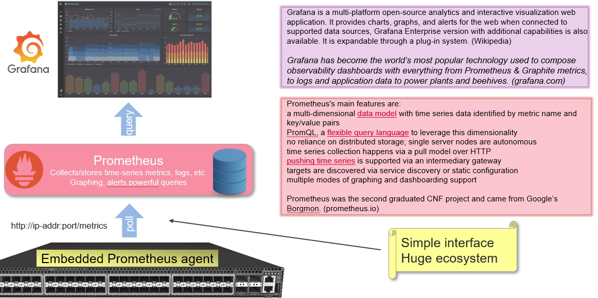

## Code Structure & Customizing
The python-based progam is very simple and consists of two primary files:
*  [custom_prom.py](custom_prom.py) - The main program which registers a custom collector and provides the HTTP endpoint (web server) via the [prometheus_client](https://github.com/prometheus/client_python) module. **Customize this to register additional collectors, add command-line options, etc.**
* [custom_metrics.py](custom_metrics_collector/custom_metrics.py) - Collects application metrics (fake data) and formats it into the Prometheus exposition format (text), in reponse to server callbacks, each time the HTTP endoint is queried. **Customize this to provide "real" application metrics.**
# Quick-start
The directions below are meant to be followed sequentially. In particular, you need to run the daemons or docker containers in the following order:
* Custom Prometheus Metrics Endpoint
* Prometheus Time-series Database docker container
* Grafana visualization docker container
  
## Set up your environment
Requirements:
* Python3
* Pip

```
sudo apt install -y python3 python3-pip
pip3 install -r requirements.txt
```

# Running Custom Prometheus Metrics Endpoint
```
python3 custom_prom.py [--port <portnum>] # default port 8000
```

The logger outputs an initial message, then prints a line for each query. The first callback happens automatically as part of the server's callback registration. Subsequent calls occur each time the http endpoint receives a GET.
```
custom_prometheus$ python3 custom_prom.py
[2022-07-15 17:12:24,054] [    INFO] custom_prom.<module>-27: Prometheus server listening on port 8000
[2022-07-15 17:12:24,054] [   DEBUG] custom_metrics.collect-36: SampleMetricsCollector() #always runs once at startup
[2022-07-15 17:12:27,139] [   DEBUG] custom_metrics.collect-36: SampleMetricsCollector()
[2022-07-15 17:12:27,428] [   DEBUG] custom_metrics.collect-36: SampleMetricsCollector()
```

## Query via Web Browser
Once you launch the server you can browser it on a web server at `ip-addr:port`, e.g. `http://localhost:8000/`

You can also use `curl` to get the data on a console, e.g.:
```
curl http://localhost:8000
```

### Example Metrics output
The metrics data are published as ordinary text; an example is given below. The upper porttion of the data contains standard, built-in metrics related to the host system and Prometheus endpoint itself, followed by our custom data, which begins at `buffer_level_bytes`.
```
# HELP python_gc_objects_collected_total Objects collected during gc
# TYPE python_gc_objects_collected_total counter
python_gc_objects_collected_total{generation="0"} 339.0
python_gc_objects_collected_total{generation="1"} 33.0
python_gc_objects_collected_total{generation="2"} 0.0
# HELP python_gc_objects_uncollectable_total Uncollectable object found during GC
# TYPE python_gc_objects_uncollectable_total counter
python_gc_objects_uncollectable_total{generation="0"} 0.0
python_gc_objects_uncollectable_total{generation="1"} 0.0
python_gc_objects_uncollectable_total{generation="2"} 0.0
# HELP python_gc_collections_total Number of times this generation was collected
# TYPE python_gc_collections_total counter
python_gc_collections_total{generation="0"} 40.0
python_gc_collections_total{generation="1"} 3.0
python_gc_collections_total{generation="2"} 0.0
# HELP python_info Python platform information
# TYPE python_info gauge
python_info{implementation="CPython",major="3",minor="8",patchlevel="10",version="3.8.10"} 1.0
# HELP process_virtual_memory_bytes Virtual memory size in bytes.
# TYPE process_virtual_memory_bytes gauge
process_virtual_memory_bytes 2.57560576e+08
# HELP process_resident_memory_bytes Resident memory size in bytes.
# TYPE process_resident_memory_bytes gauge
process_resident_memory_bytes 2.1106688e+07
# HELP process_start_time_seconds Start time of the process since unix epoch in seconds.
# TYPE process_start_time_seconds gauge
process_start_time_seconds 1.65793034325e+09
# HELP process_cpu_seconds_total Total user and system CPU time spent in seconds.
# TYPE process_cpu_seconds_total counter
process_cpu_seconds_total 0.06999999999999999
# HELP process_open_fds Number of open file descriptors.
# TYPE process_open_fds gauge
process_open_fds 7.0
# HELP process_max_fds Maximum number of open file descriptors.
# TYPE process_max_fds gauge
process_max_fds 1024.0
# HELP buffer_level_bytes The number of bytes stored in a buffer
# TYPE buffer_level_bytes gauge
buffer_level_bytes{portnum="1",speed="100GBPS",type="Ethernet"} 2.0
# HELP rx_packets_total The number of packets received
# TYPE rx_packets_total counter
rx_packets_total{portnum="1",speed="100GBPS",type="Ethernet"} 20.0
# HELP port_link_status Link state of an interface (port)
# TYPE port_link_status gauge
port_link_status{port_link_status="DOWN",portnum="1",speed="100GBPS",type="Ethernet"} 0.0 1657930347428
# HELP buffer_level_bytes The number of bytes stored in a buffer
# TYPE buffer_level_bytes gauge
buffer_level_bytes{portnum="2",speed="50GBPS",type="Ethernet"} 8.0
# HELP rx_packets_total The number of packets received
# TYPE rx_packets_total counter
rx_packets_total{portnum="2",speed="50GBPS",type="Ethernet"} 40.0
# HELP port_link_status Link state of an interface (port)
# TYPE port_link_status gauge
port_link_status{port_link_status="UP",portnum="2",speed="50GBPS",type="Ethernet"} 1.0 1657930347428
```

# Prometheus
>**Note:** The prometheus server data is stored in the container filesystem and is ephermeral. You will need to create a docker shared volume to store the data on your host. Map a directory to `/prometheus/data` in the container.
## Install Prometheus using Docker
This is the quickest method.
```
docker pull prom/prometheus
```

## Create a custom endpoint config
Use the included file [custom-prom-cfg.yml](custom-prom-cfg.yml), shown below, or make your own.

```
global:
  scrape_interval:     15s # By default, scrape targets every 15 seconds.

  # Attach these labels to any time series or alerts when communicating with
  # external systems (federation, remote storage, Alertmanager).
  external_labels:
    monitor: 'custom prometheus'

# A scrape configuration containing exactly one endpoint to scrape:
# Here it's Prometheus itself.
scrape_configs:
  # The job name is added as a label `job=<job_name>` to any timeseries scraped from this config.
  - job_name: 'custom prometheus'

    # Override the global default and scrape targets from this job every 5 seconds.
    scrape_interval: 5s

    static_configs:
      # Note don't use "localhost" because it won't resolve inside the docker container
      # Instead use 127.0.0.1
      - targets: ['127.0.0.1:8000']
        labels:
          group: 'custom'
```

## Run Prometheus
### Start in Forground mode
```
docker run -it --rm --name custom_prometheus -p 9090:9090 -v $PWD/custom-prom-cfg.yml:/etc/prometheus/prometheus.yml prom/prometheus --config.file=/etc/prometheus/prometheus.yml
```
This will output logging info to a console. Terminate via `CTRL-c` or `docker kill custom_prometheus` in another terminal.

You can use `--net=host` in place of `-p 9090:9090` to run the docker container entirely in the hosts networking namespace.

### Start in Daemon Mode
You can also run it in daemon mode, it will not log to the console:
```
docker run -d ---rm --name custom_prometheus --net=host -v $PWD/custom-prom-cfg.yml:/etc/prometheus/prometheus.yml prom/prometheus --config.file=/etc/prometheus/prometheus.yml
```
Terminate via `docker kill custom_prometheus`.

You can use `--net=host` in place of `-p 9090:9090` to run the docker container entirely in the hosts networking namespace.

### Visualize Metrics in Prometheus
Prometheus has a rudimentary WebUI which lets you view stored metrics. Browse the WebUI at `locahost:9090`. Below is an example. You can start typing in the name of a metric into the "Search" box and an autocomplete drop-down will help you choose a metric to display. You can view in tabular or graphical form.
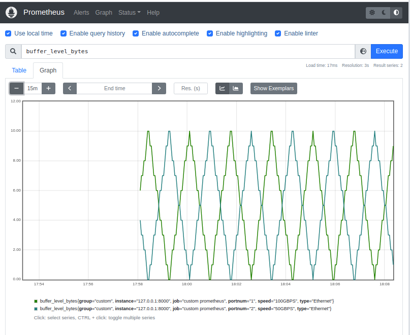

## Prometheus - Going Further
* Make the time-series data persistent by mapping a host file directory to the Prometheus `/prometheus/data` directory.
# Grafana
## Install and Run Grafana using Docker
Ths will pull the image and start it on its default port (3000) as well as map to host port 3000:
```
docker run -d --name grafana -p 3000:3000 grafana/grafana
```
## Configure Grafana to use Prometheus data source
Browse `http://localhost:3000` and log in to Grafana with the default username `admin` and password `admin`. You can see the home page as follows:

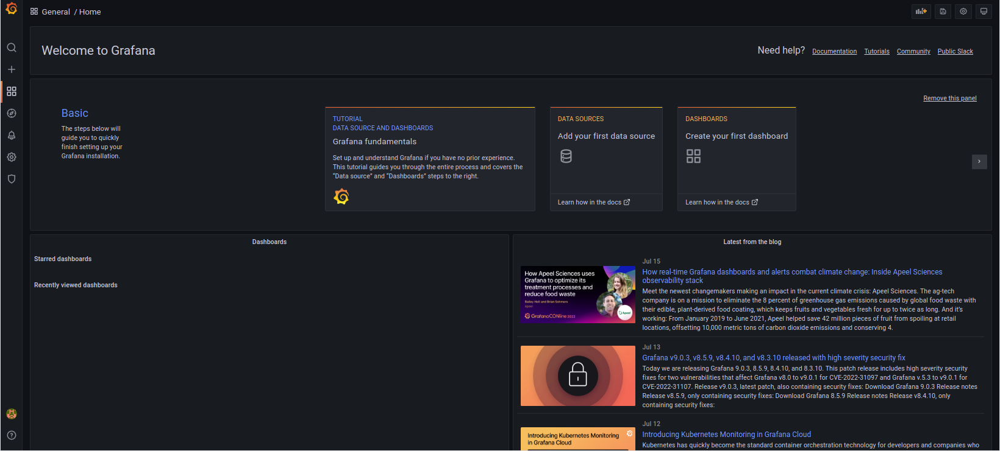

Click on **Add Data Source**, you will see a list of sources like below:
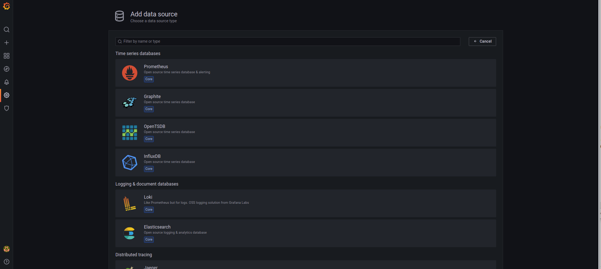

Click on **Prometheus**, you will get a Prometheus Config screen like below:
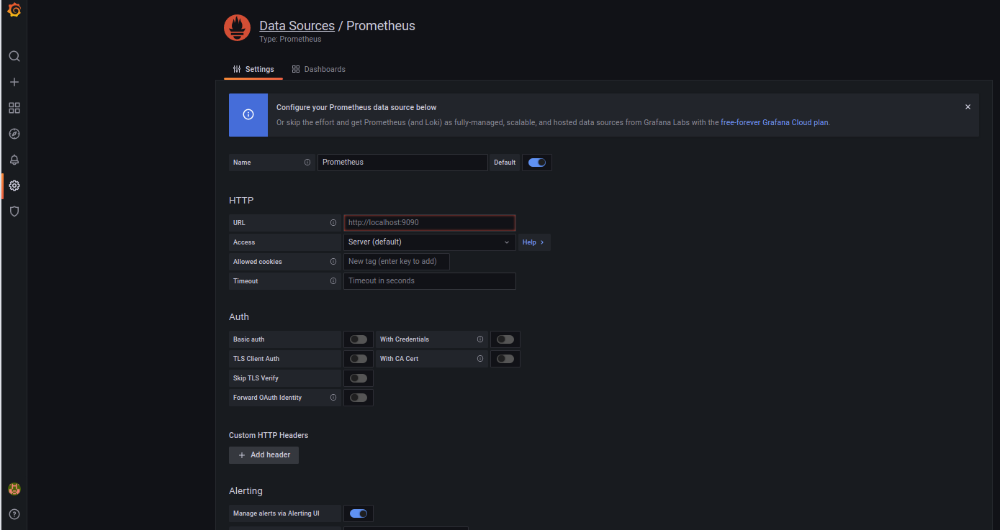

Configure the **URL** using the absolute IP address of the host machine. In particular, *localhost* and *127.0.0.1* will not work. (Note: The initial state of this entry box *appears* like it has the default value already entered, `http://localhost:9090`, but in fact it's just "help text" and not really "entered.")

Ther are various Docker networking techniques to avoid having to enter the absolute IP address; those are beyond the scope of this tutorial.

Below is an example: of a properly configured URL:
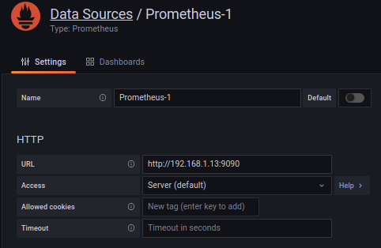

Click the **Save and Test** button at the very bottom of the screen. You should get a "Data source is working" message. See example below:


You are now ready to add metrics panels!

## Create Grafana Panels and Visualize Data
Now comes the fun part! Lets view some of the data stored in the Prometheus database.

Click on the `+` menu icon in the left panel, then select **Dashboard** to create a new dashboard. See below.

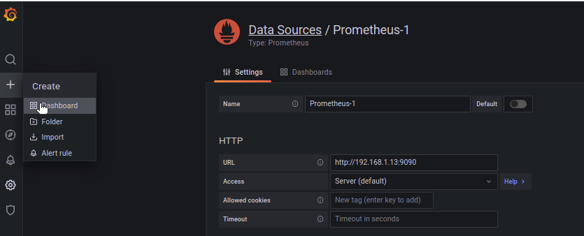

Click on **Add a new panel**

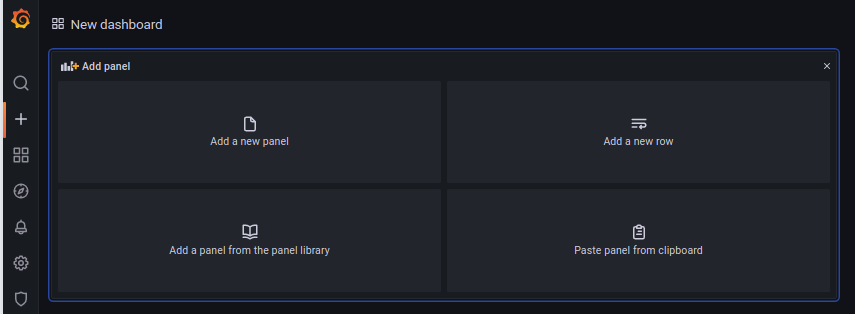

Configure the panel by changing the **title**, type of display, etc. By default it'll select a line graph. 

You also need to select a data source and metric. The data source will default to the Proemetheus source. The name may differ from the example.

Select a metric by typing into the **Metrics Browser** entry box, or using the pull-down widget and look for a suitable candidate. In this case, we typed "buf" and the auto-complete presented a choice of `buffer_level_bytes` which we selected.

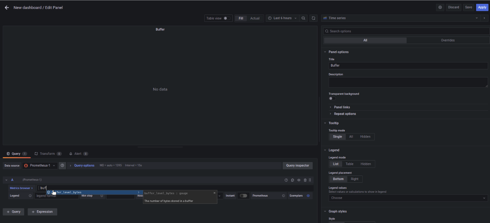

Adjust the time scale and click the refresh widget, as needed, to see a graph of your data. See below.

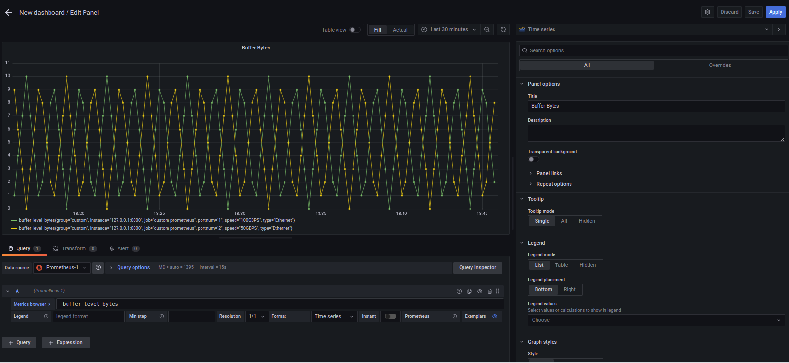

You can construct queries using the [Promql](https://prometheus.io/docs/prometheus/latest/querying/basics/) language. For example, let's view only Port 1's buffer level. Edit the query to ` buffer_level_bytes {portnum='1'}`. The content inside the curly braces is a promql query expression which matches on the `portnum` label. The resulting graph is below:

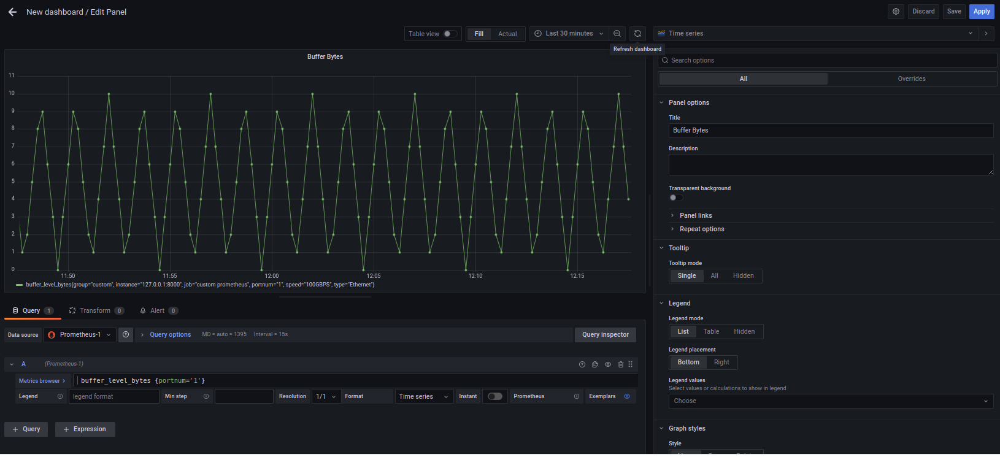

## Grafana - Going Further
More things to try in the GUI:
* Save the panel in your dashboard
* Make more new panels in the dashboard, e.g. view `rx_packets_total`
* Export the grafana config as `.json` for re-use later

You can find a vast amount of online documentation and YouTube videos to learn more about Grafana. This is barely scraping the surface. Have fun!